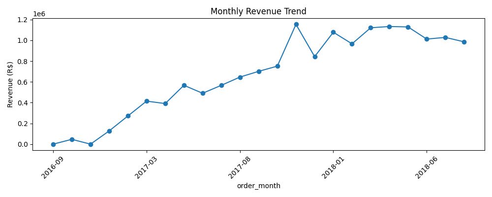
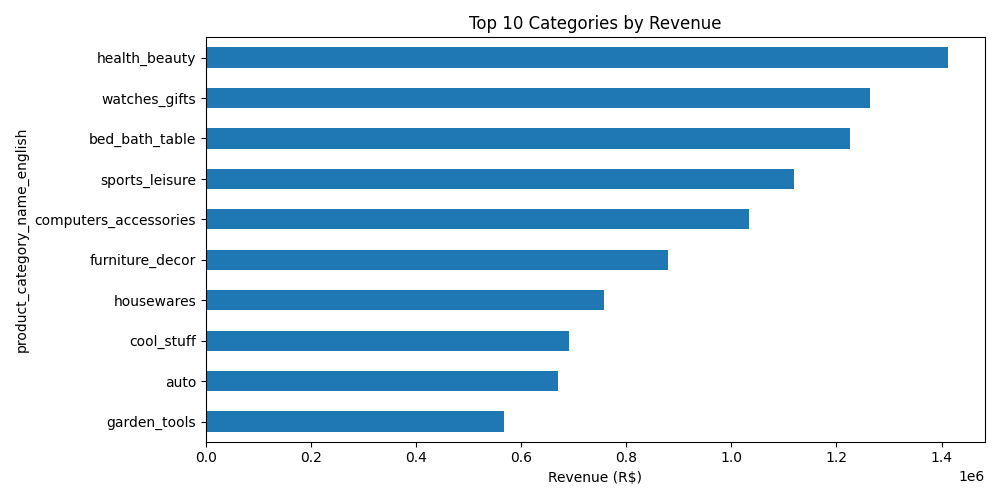

# Retail Sales Performance Analysis — Olist E-Commerce (Brazil)

**Tools:** Python (pandas), SQL (SQLite), Tableau / Power BI
**Dataset:** [Olist Brazilian E-Commerce Public Dataset](https://www.kaggle.com/olistbr/brazilian-ecommerce) — ~100K orders, 2016–2018

## Business Questions
1. Which product categories and regions drive the most revenue?
2. Are there seasonal trends in sales?
3. Do delivery delays affect customer review scores?
4. Which payment methods and installment patterns are most common, and how do they relate to order value?
5. Who are the top-performing sellers, and where are they located?

## Project Structure
```
olist_project/
├── data/                        # raw CSVs (9 relational tables)
├── olist.db                     # SQLite database (all tables loaded)
├── sql/
│   └── analysis_queries.sql     # 9 queries answering the business questions above
├── notebooks/
│   ├── eda.py                   # Python EDA — cleaning, exploration, export
│   ├── monthly_revenue_trend.png
│   ├── top_categories_revenue.png
│   └── olist_dashboard_ready.csv  # flattened, dashboard-ready export
└── README.md
```

## Methodology
1. **Loaded** 9 raw CSVs into a relational SQLite database (`olist.db`) using Python/pandas.
2. **Cleaned & validated** in Python: checked for duplicates, nulls, and filtered to `delivered` orders only for revenue analysis (excludes cancelled/in-transit orders, which would understate delivery performance and overstate open revenue).
3. **Queried** the database directly in SQL to answer each business question — including joins across customers, orders, order items, products, and payments; a running-revenue-total window function; and a per-state category ranking using `RANK()`.
4. **Explored** the data in Python (pandas/matplotlib) to sanity-check trends before building the dashboard.
5. **Exported** a flattened, dashboard-ready CSV (`olist_dashboard_ready.csv`) and built an interactive dashboard in [Tableau/Power BI — add your published link here].

## Key Findings
*(Fill this in after you review the SQL query outputs and charts — aim for 3-4 bullets in the "so what" format, e.g.:)*
- *Category X accounts for Y% of total revenue but has a below-average order value, suggesting a volume-driven, low-margin segment.*
- *Orders delivered late average a review score of A vs. B for on-time orders — a Z-point drop.*
- *State X leads in both order volume and revenue, while State Y shows high revenue per order despite fewer customers.*

## Exploratory Charts
Generated in Python during initial exploration (`notebooks/eda.py`):

**Monthly Revenue Trend**


**Top 10 Categories by Revenue**


## Interactive Dashboard
*(Not yet built — this is the next step. Once published, replace this section with:)*
- A screenshot of the dashboard
- A link to the live, published version on Tableau Public or Power BI

[Add screenshot + link to published Tableau Public / Power BI dashboard here]

## What I'd Explore Next
- Customer segmentation / RFM analysis to identify high-value repeat customers
- Cohort retention analysis by first purchase month
- Predicting delivery delays using order and seller features
